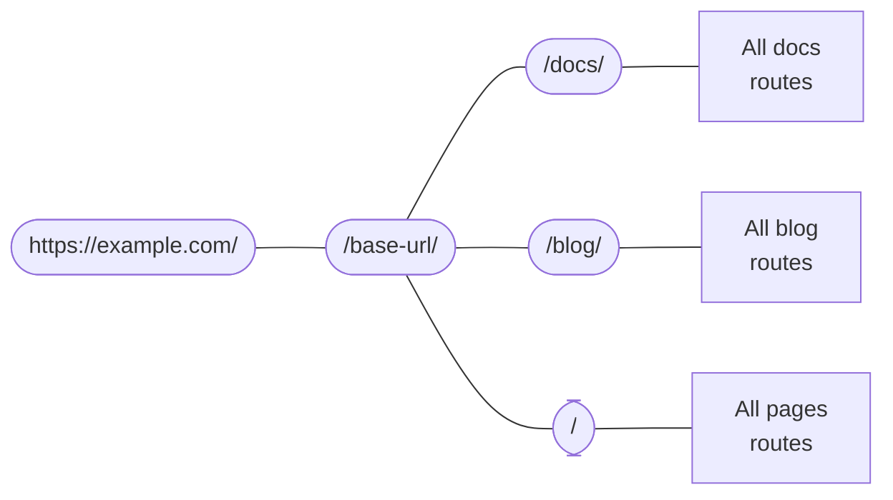

# Demo

## 绘图Mermaid

脑图

流程图

## 提示框

:::info

The API documentation of each official plugin lists the supported attributes:

- [Docs front matter]
- [Blog front matter]
- [Pages front matter]

:::

:::note

In practice, those are not really HTML elements, but React JSX elements, which we'll cover next!

:::

:::caution

Each locale is a **distinct standalone single-page application**: it is not possible to start the Docusaurus sites in all locales at the same time.

:::

:::tip

Docusaurus provides **default translations** for generic theme labels, such as "Next" and "Previous" for the pagination.

Please help us complete those **[default translations]**.

:::

:::warning TL;DR

We recommend avoiding them.

:::
